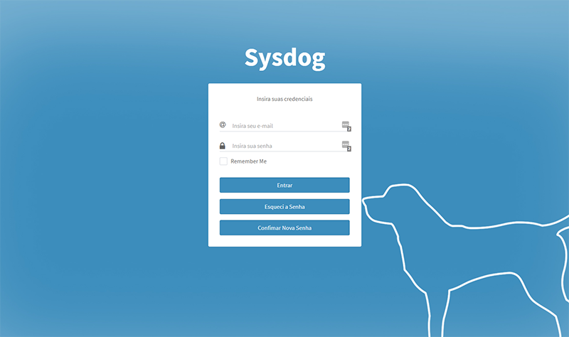
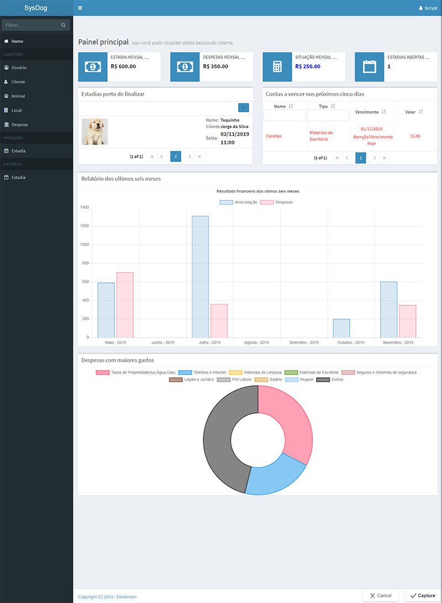
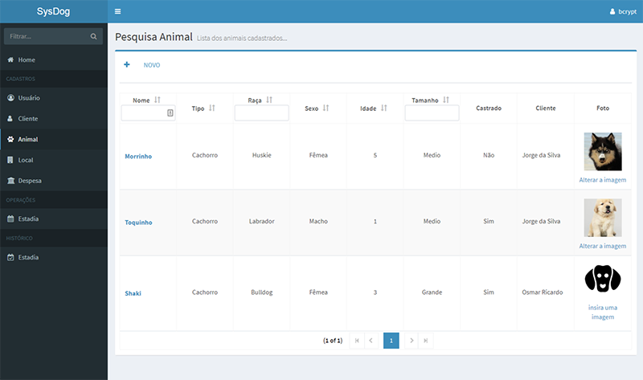
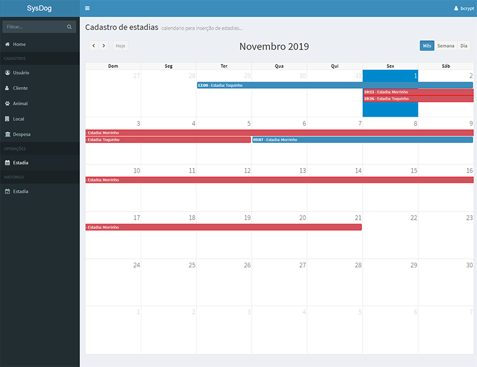
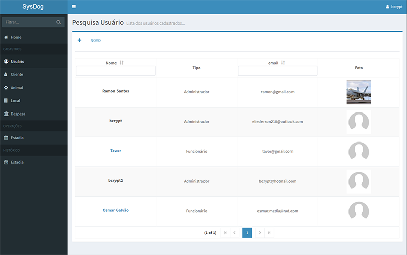
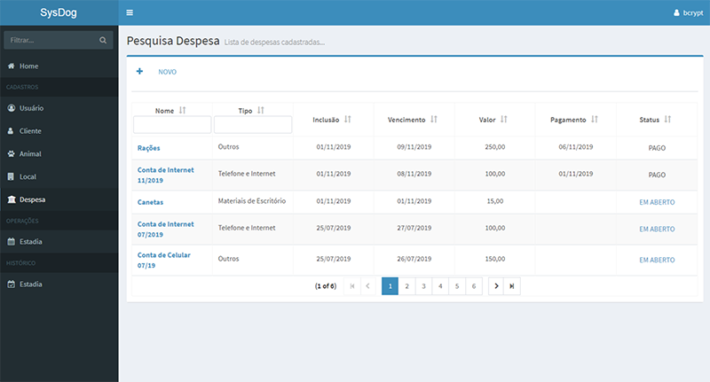
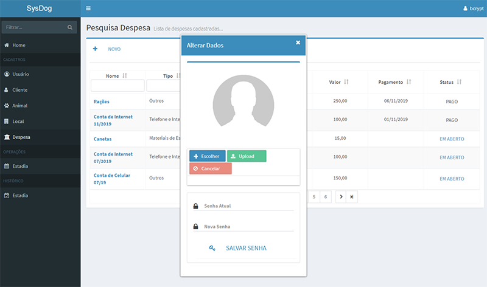
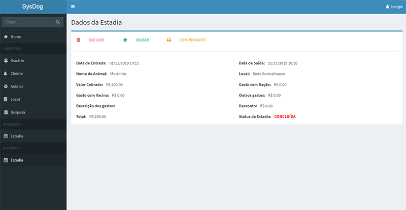
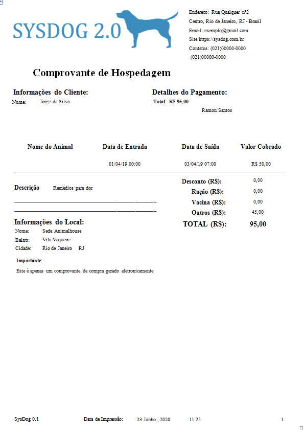

# SysDog 2.0

Sistema de Gerenciamento de Hospedaria de animais

## Descrição

Está é a atualização do sistema anterior, usando uma nova interface gráfica e novas funções.

## Telas





















### Requisitos

Este sistema atualmente roda com o MariaDB 10.x e Apache 9.0

### Instalação

Para usar pela primeira vez execute os seguintes passos: 

```
Usando seu gerenciador de BD crie o Banco de dados "sysdog3"
```

```
No pacote com.esl.test execute o arquivo UsuarioDAOTest.java com "run as..." , "Junit Test"
```
```
Este arquivo contem o método que executará a inserção de um usuario.
```
```
Agora basta executar o sistema com o Apache, os logins colocados para exemplo são

login: tes@hotmail.com  senha: 87654321     Administrador
```

## Testes

Neste sistema eu usei o JUnit para testar métodos durante a fase de desenvolvimento.
elas estão na pasta src/test/java

## Bugs

O sistema de envio ainda ainda tem alguns problemas na configuração que serão solucionados 
em futuras atualizações 

## Softwares Usados


* [Primefaces 7.0](https://www.primefaces.org/) - Gerenciamento da interface JSF
* [Adminfaces](https://github.com/adminfaces) - Tema customizado para o primefaces
* [MariaDB 10.x](https://mariadb.org/) - Banco de dados usado
* [Maven](https://maven.apache.org/) - Gerenciamento de dependências
* [Apache 9.0](https://www.apache.org/) - Servidor usado
* [JasperSoft](https://community.jaspersoft.com/download) - Criação de relatórios
* [Apache Shiro](https://shiro.apache.org) - Segurança 
* [jBCrypt](https://github.com/jeremyh/jBCrypt) - Encriptação de senhas com bcrypt
* [AWS S3](https://aws.amazon.com/pt/s3/) - Armazenamento de imagens

## Versão

A versão colocada aqui é a usada durante o desenvolvimento na versão 2.0

## Sobre o Projeto

* Esta é uma versão aperfeiçoada do projeto anterior usando novas tecnlogias 
* Houve uma mudança no aspecto visual com uso de uma interface mais amigavel com o AdminFaces
* O sistema de segurança foi alterado do PhaseListener para o Apache shiro que tem um melhor desempenho
 com JSF
* A encriptação das senhas agora é feita com o brcypt.
* Agora os avatares dos animais,usuarios são gravada em um servidor AWS S3.
* Tambem foi feito o uso de charts na pagina inicial, com informações resumidas
* Foi implementado a primeira parte do uso de email para recuperção e alteração de senha.
 

## Futuro

* Esta previsto um aperfeiçoamento do uso dos charts em uma parte especifica com mais dados disponiveis
* Uso de email para envio ao cliente sobre abertura de nova estadia, confirmação de pagamento, entre outros 

## Referências

As seguintes referências foram usadas no densenvolvimento desse projeto

* [Programação web com java - Sergio Roberto delfino] (https://www.youtube.com/watch?v=9PGp1T242hA&list=PL_GwGUsBlNyfI0W3ggfffhBdJUqB4981Z)
* [Curso Spring Boot, Hibernate, REST, Ionic, JWT, S3, MySQL, MongoDB] (https://www.udemy.com/course/spring-boot-ionic/)

## Autor

* **Eliederson Linhares**  - (https://github.com/EliedersonLinhares)
*   Email: eliederson210@outlook.com


## Licensa

Este projeto estará sobre a licensa MIT.

